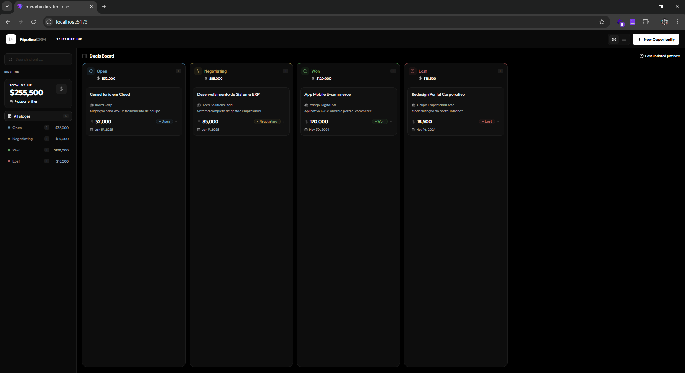

# PipelineCRM 

A modern Kanban CRM interface built with React + Vite for managing sales opportunities.



## Tech Stack

| Concern | Library |
|---------|---------|
| Build & Dev | Vite + TypeScript |
| Server state | **TanStack Query v5** — cache, loading, error, invalidation |
| Global UI state | **Zustand** — filters, view mode, modal open/close |
| Forms + validation | **React Hook Form** + **Zod** |
| Styling | Pure CSS with CSS custom properties (no Tailwind) |
| HTTP client | Axios |
| Icons | Lucide React |
| Testing | **Vitest** + **Testing Library** |

## Getting Started

> The frontend proxies `/api` → `http://localhost:3000`. Start the backend first.

```bash
# 1. Install dependencies
npm install

# 2. Start the API (in a separate terminal)
cd ../oportunidades-api && npm run start:dev

# 3. Start the frontend
npm run dev          # http://localhost:5173
```

## Available Scripts

```bash
npm run dev          # development server
npm run build        # production build
npm run test         # run tests once
npm run test:watch   # watch mode
npm run test:coverage # coverage report
```

## Features

- **Kanban Board** — four columns (Open / Negotiating / Won / Lost) with per-column totals
- **List View** — table layout with sortable rows, toggle from navbar
- **Sidebar** — live pipeline value, per-status counts and aggregated value, one-click status filter
- **Client search** — debounce-friendly search field that filters across views
- **Inline status update** — click the badge on any card to change status with a dropdown
- **Two-step delete** — confirm prompt prevents accidental deletions
- **Create modal** — validated form (React Hook Form + Zod) with real-time field errors
- **Skeleton loaders** — shimmer placeholders on every loading state
- **Toast notifications** — success/error feedback for every mutation
- **Responsive** — sidebar hidden on mobile, kanban columns scroll horizontally

## Architecture Decisions

**Pure CSS over Tailwind**  
Tailwind v4 + `@tailwindcss/vite` had a plugin issue in this env that caused styles not to be applied. Switched to CSS custom properties (variables) which gave more design control with zero runtime overhead.

**Zustand for UI state, TanStack Query for server state**  
These two concerns are separated intentionally. Zustand owns ephemeral UI (which filter is active, modal open). TanStack Query owns all server data with automatic cache invalidation after mutations — no manual `useState` arrays to sync.

**Zod + React Hook Form**  
Schema-first validation means the Zod schema is the single source of truth. TypeScript types are inferred from it (`z.infer`), so the form, the API payload, and the types all stay in sync automatically.

**CSS architecture**  
All design tokens live in `:root` CSS variables. Components reference variables, never hardcoded values. This makes theming and dark mode trivial. Class names follow a BEM-lite convention (`deal-card`, `deal-card-top`, `deal-value`).

## Project Structure

```
src/
├── __tests__/           # Vitest + Testing Library tests
│   ├── CreateModal.test.tsx
│   ├── DealCard.test.tsx
│   ├── KanbanColumn.test.tsx
│   ├── Navbar.test.tsx
│   ├── StatusBadge.test.tsx
│   └── utils.test.ts
├── components/
│   ├── dashboard/       Sidebar (pipeline overview + filters)
│   ├── kanban/          KanbanBoard, KanbanColumn
│   ├── layout/          Navbar
│   ├── opportunities/   DealCard, ListView, CreateModal
│   └── ui/              StatusBadge, StatusSelect, Toast, Skeleton
├── hooks/               useOpportunities, useDashboard (TanStack Query)
├── lib/                 api.ts (Axios), schemas.ts (Zod), utils.ts
├── store/               ui.store.ts (Zustand)
├── test/                setup.ts, mocks.ts, renderWithProviders.tsx
└── types/               index.ts
```

## What I'd Improve With More Time

- **Drag-and-drop** between Kanban columns (`@dnd-kit/core` is already installed)
- **Optimistic updates** — update the UI instantly before the API responds
- **Pagination / infinite scroll** on the list view for large datasets
- **Date range filters** and a value range slider in the sidebar
- **E2E tests** with Playwright covering the full create → update → delete flow
- **React Router / TanStack Router** for deep-linkable filtered views (`/board?status=aberta`)
- **Storybook** for isolated component development and visual regression
- **Graphic Dashboard** for better analysis
- **Ai Integration**
